

**SISTEMA INFORMÁTICO TRANSACCIONAL DE LA DIRECCIÓN DEL SEGURO DE SALUD DEL ISSFA**

**MÓDULO: DISTRIBUCIÓN DE TRÁMITES**

**MANUAL DE USUARIO**

**Versión 2.0**

**2021**

# **Índice de** **Contenido**
` `TOC \o "1-3" \h \z \u [INTRODUCCIÓN	 PAGEREF _Toc83646353 \h 3](#_Toc83646353)

[OBJETIVO	 PAGEREF _Toc83646354 \h 3](#_Toc83646354)

[ALCANCE	 PAGEREF _Toc83646355 \h 3](#_Toc83646355)

[MAPA GENERAL	 PAGEREF _Toc83646356 \h 3](#_Toc83646356)

[DESCRIPCIÓN FUNCIONALIDADES	 PAGEREF _Toc83646357 \h 4](#_Toc83646357)

[1.	Ingreso al Sistema	 PAGEREF _Toc83646358 \h 4](#_Toc83646358)

[2.	Opciones Menú	 PAGEREF _Toc83646359 \h 5](#_Toc83646359)

[2.1 Parámetros	 PAGEREF _Toc83646360 \h 5](#_Toc83646360)

[2.1.1	Periodos	 PAGEREF _Toc83646361 \h 5](#_Toc83646361)

[2.1.2	Priorización	 PAGEREF _Toc83646362 \h 7](#_Toc83646362)

[2.1.3	Productividad	 PAGEREF _Toc83646363 \h 9](#_Toc83646363)

[2.1.4	Usuarios	 PAGEREF _Toc83646364 \h 10](#_Toc83646364)

[2.2.	Procesos – Distribución Expedientes	 PAGEREF _Toc83646365 \h 12](#_Toc83646365)

[2.2.1	Secuencial (Uno – Varios Usuarios)	 PAGEREF _Toc83646366 \h 14](#_Toc83646366)

[2.2.2	Múltiple (Un solo usuario)	 PAGEREF _Toc83646367 \h 17](#_Toc83646367)

[2.2.3	Reasignación (Varios Trámites – Un solo usuario)	 PAGEREF _Toc83646368 \h 18](#_Toc83646368)

[2.3.	Reportes	 PAGEREF _Toc83646369 \h 21](#_Toc83646369)

[2.3.1. Reporte de Distribución	 PAGEREF _Toc83646370 \h 22](#_Toc83646370)

[2.3.2. Total Exp. Usr.	 PAGEREF _Toc83646371 \h 23](#_Toc83646371)

**

**INTRODUCCIÓN**

El presente documento servirá como guía para el manejo de las funcionalidades desarrolladas del Módulo de “Distribución Automática de Trámites” como parte de la actualización del Sistema Informático Transaccional de la Dirección del Seguro de Salud del ISSFA. 

Como antecedente, el Módulo de “Distribución Automática de Trámites” nace como una necesidad de la Dirección del Seguro de Salud del ISSFA para realizar la asignación de trámites en cada fase del proceso de Auditoría de la Calidad de la Facturación de los servicios de salud.

**OBJETIVO**

Brindar una guía de uso de las funcionalidades desarrolladas correspondientes al Módulo de Distribución Automática de Trámites como parte de la actualización del Sistema Informático Transaccional de la Dirección del Seguro de Salud del ISSFA.

**ALCANCE**

Detallar de manera clara cada una de las funcionalidades requeridas como parte de la actualización del Sistema Informático Transaccional de la Dirección del Seguro de Salud del ISSFA.

**MAPA GENERAL** 

**Gráfico 1.** Visión general de la funcionalidad de Distribución dentro del “Proceso de Auditoría de la Calidad de la Facturación de los Servicios de Salud”

**DESCRIPCIÓN FUNCIONALIDADES** 
1. # **Ingreso al Sistema**
El módulo de “Homologación, Supervisión y Monitoreo” es parte del Sistema Transaccional Informático de la Dirección de Salud, por lo que se puede acceder desde la Intranet del ISSFA. 

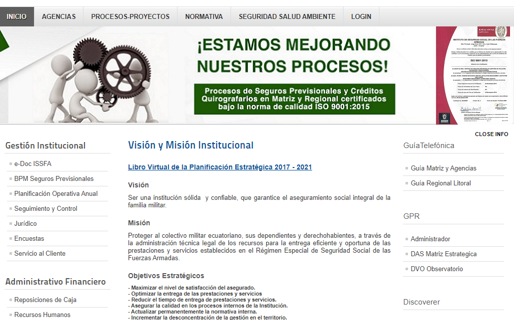

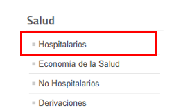

Luego de seleccionar la opción de “Hospitalarios”, se debe Ingresar el usuario y contraseña en la ventana de identificación que se presenta y presionar el botón “Inicio de Sesión”.

Al dar clic en el botón “Inicio de Sesión”, se despliega una pantalla con el menú del Sistema Informático Transaccional de la Dirección del Seguro de Salud del ISSFA, con las opciones habilitadas de acuerdo al perfil del usuario que ingresa:

**NOTA:** Los siguientes perfiles tendrán acceso al proceso de supervisión: Supervisor Gestión Documental, Supervisor Auditoria Medica, Supervisor Control de Tarifas, Jefe Auditoría y Jefe Tarifario.

1. # **Opciones Menú**
## **2.1 Parámetros**
Para ejecutar el proceso de Distribución se requerirá realizar la respectiva parametrización, la misma que estará habilitada de acuerdo al perfil del usuario.

Las parametrizaciones de Periodos, Priorización y Productividad estarán habilitadas únicamente para los perfiles de Jefe Auditoría y Jefe Tarifario.

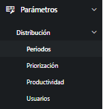

Los supervisores de las fases de Gestión Documental, Auditoría Médica y Liquidación podrán únicamente parametrizar los usuarios por período y fase.

` `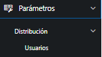

1. ### Periodos
A esta parametrización únicamente tendrán acceso los usuarios con perfil de Jefe de Auditoría Médica y Jefe de Liquidación.

El sistema realiza el proceso de distribución de trámites en función del periodo al que pertenecen los trámites en las distintas fases. Al ingresar a esta opción se podrá crear, editar y eliminar periodos.

**NOTA:** Para que un periodo se muestre en el listado de periodos en los distintos procesos y reportes del sistema debe estar creado y en estado Activo.

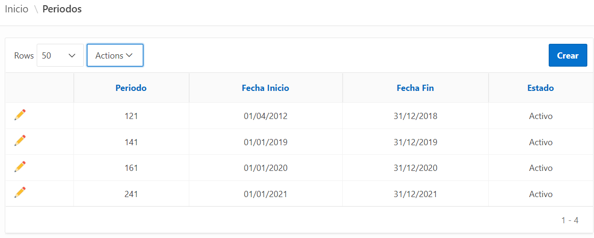

**Crear Periodos:**

Para crear un Periodo se debe hacer clic en el botón “Crear”, ingresar la información del periodo y presionar Guardar en la pantalla que se muestra a continuación:

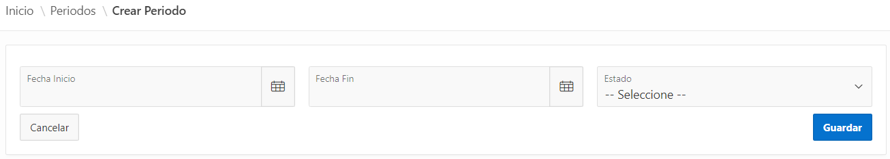

Si el proceso se ha realizado exitosamente se mostrará un mensaje y el periodo creado aparecerá en el Listado de Periodos.

**Nota:** La fecha Inicio y Fin ingresada no puede estar dentro de otro periodo ya creado, en caso de estarlo se mostrará el siguiente mensaje de error:

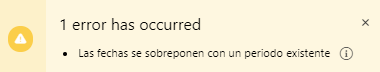

**Editar/ Eliminar Periodos:**

En el listado de periodos se debe presionar  del periodo que se requiere modificar; en la pantalla que se muestra se actualiza la información guardada del periodo y se presiona Actualizar.

En el caso de que se requiera eliminar el periodo se presiona el botón Eliminar y se confirma la eliminación presionando OK.

**NOTA:** No se puede eliminar un periodo si existen trámites ya distribuidos para ese periodo.

1. ### Priorización
A esta parametrización únicamente tendrán acceso los usuarios con perfil de Jefe de Auditoría Médica y Jefe de Liquidación.

En esta funcionalidad se podrá priorizar el orden de distribución del trámite de acuerdo al parámetro de ordenamiento establecido.

Los puntos establecidos son: Tipo de servicio, Fecha de presentación de servicio y Fecha de ingreso de solicitud.

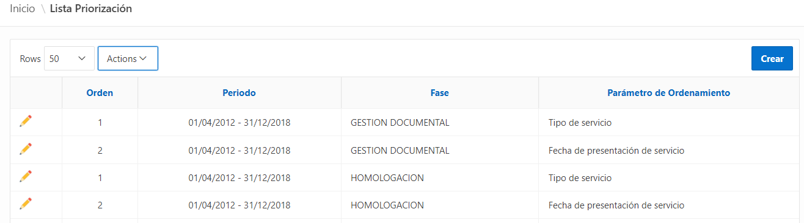

**Crear Priorización** 

En la pantalla “Lista Priorización” se debe hacer clic en el botón “Crear”, ingresar la información y presionar Guardar en la pantalla que se muestra a continuación:

**NOTA:** Al dar clic en el campo Prioridad se desplegará una lista con los valores: 1, 2 y 3 que indicará el orden en el que se distribuirán los trámites de acuerdo al parámetro de ordenamiento seleccionado.

Si el proceso se realizó correctamente se mostrará el siguiente mensaje:

**Editar/ Eliminar Prioridad** 

En el listado de priorización se debe presionar  de la prioridad que se requiere modificar; en la pantalla que se muestra se actualiza la información guardada del periodo y se presiona Actualizar.

En el caso de que se requiera eliminar la priorización creada se debe presionar eliminar y en el mensaje de confirmación presionar OK.

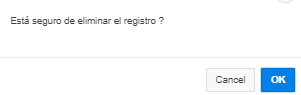
1. ### Productividad
A esta parametrización únicamente tendrán acceso los usuarios con perfil de Jefe de Auditoría Médica y Jefe de Liquidación.

En esta funcionalidad se realiza la parametrización de la productividad de acuerdo al Periodo, Fase y Tipo de servicio.

`	`**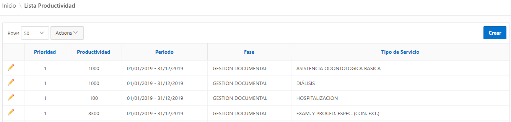**

**NOTA:**  Si el servicio no se encuentra parametrizado para un periodo y fase determinado no se mostrarán los trámites para la distribución correspondientes a ese periodo, fase y tipo de servicio. 

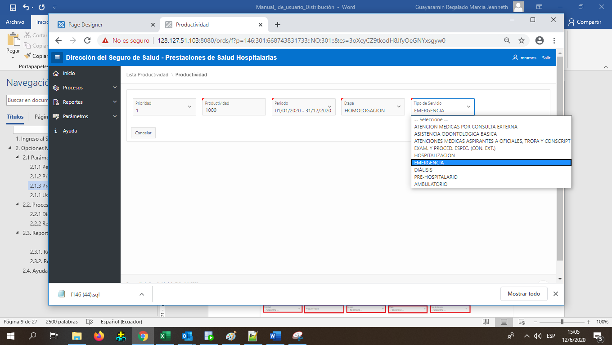

**Crear Productividad**

En la pantalla “Lista Productividad” se debe hacer clic en el botón “Crear”, ingresar la información y presionar Guardar en la pantalla que se muestra a continuación:

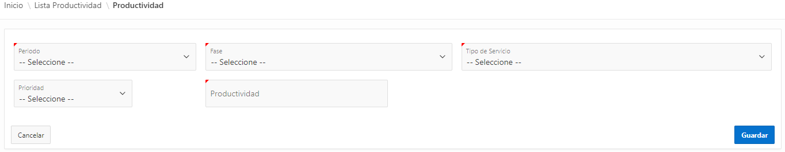

**Nota:** Al dar clic en Prioridad se desplegará una lista con los valores: 1, 2, 3 y 4 e indicará el orden con el que se distribuirán los trámites de acuerdo al tipo de servicio seleccionado.

**Editar/ Eliminar Productividad**  

En el listado de productividad se debe presionar  de la productividad que se requiere modificar; en la pantalla que se muestra se actualiza la información guardada y se presiona Actualizar.

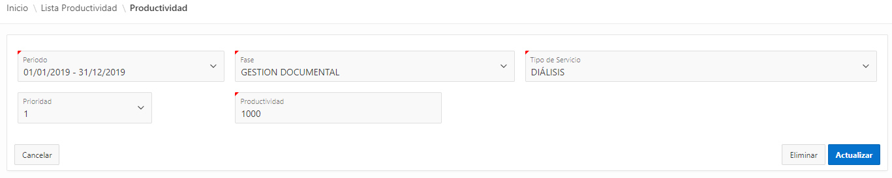

En el caso de que se requiera eliminar un registro de productividad creado se debe presionar eliminar y en el mensaje de confirmación presionar OK.

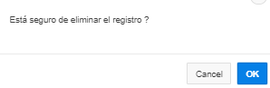

1. ### Usuarios
A esta opción tendrán acceso los usuarios con perfil Supervisor o Jefe. En esta funcionalidad se podrán crear, eliminar y editar usuarios por periodo y fase, los mismos que se mostrarán entre los usuarios disponibles para realizar los procesos de distribución y reasignación de expedientes de un determinado trámite. 

Cada usuario maneja un estado “Activo” o “Inactivo”, el cual puede ser modificado de la siguiente manera:

***Manual:*** El Supervisor o Jefe cambia el estado del usuario de Activo a Inactivo o viceversa según lo requiera.

***Automático:*** Al crear un usuario que ya existía en el sistema en diferente periodo o fase, el nuevo usuario se creará en estado “Activo” y el anterior automáticamente cambiará de estado a “Inactivo”.

Se cambiará a estado “Inactivo” el usuario en cualquier periodo o fase que se encuentre parametrizado luego que se coloque en “Activo” al usuario en un periodo y fase determinado.

Al seleccionar la opción de Usuarios se abrirá la siguiente pantalla: 

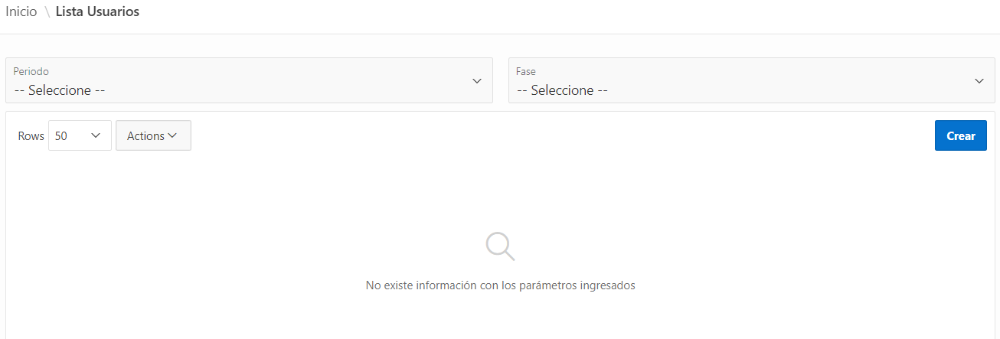

Luego de seleccionar el Periodo y la Fase se mostrará el listado de usuarios con su respectivo estado:

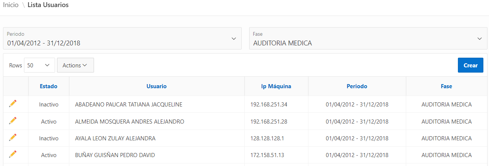

` `**NOTA:** Para eliminar un usuario se debe cambiar el estado a “Inactivo”, en cuyo caso el usuario no se mostrará en el listado de distribución o reasignación.

**Crear Usuario:**

Para crear un Usuario se debe hacer clic en el botón “Crear” luego de que se haya seleccionado un periodo y fase determinado, en caso de que no se los haya seleccionado se mostrará el siguiente mensaje:

En la pantalla que se muestra se debe ingresar la información del usuario y presionar Guardar en la pantalla que se muestra a continuación:

Si el proceso se ha realizado exitosamente se mostrará un mensaje y el usuario creado aparecerá en el Listado de Usuarios.

**NOTA:** Se mostrarán en el listado de Usuarios los que tengan el perfil requerido en la fase seleccionada.

**Editar Usuario:**

En el listado de usuarios se debe presionar  del usuario que se requiere modificar; en la pantalla que se muestra se actualiza la información guardada del usuario y se presiona Actualizar.

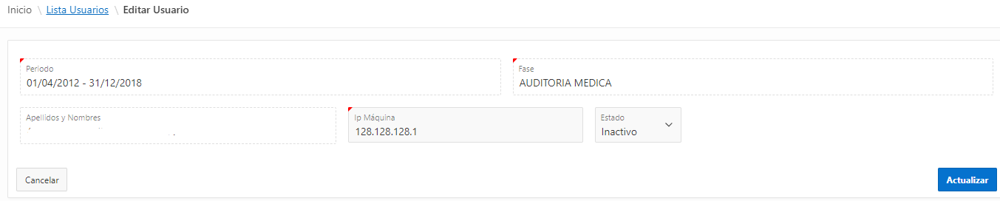

2. ## **Procesos – Distribución Expedientes**
Para procesar los trámites en cada una de las fases es necesario distribuir/asignar los expedientes a uno o más usuarios. 

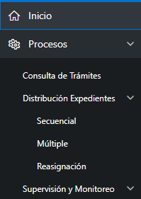

El proceso de distribución de trámites en las distintas fases requiere que:

\* Se haya parametrizado el servicio en la fase (opción – Productividad).

\* Los usuarios estén activos/creados en la fase y periodo determinado.

\* El trámite tenga las condiciones adecuadas: 

`    `- Estado:  Gestión Documental                       -> Recibido, En Proceso

`                    `Auditoría Médica/Liquidación        -> En Proceso

`    `- Esté finalizada la fase anterior.

`    `- No se haya procesado el trámite en otra aplicación en la fase que se requiere distribuir.

**NOTAS:**

a. Previo al proceso de distribución se realiza la validación de las diferentes novedades (Todas las fases de acuerdo a la matriz de aplicación) con el fin de que el trámite no tenga inconvenientes en la fase en la que se vaya a procesar, en caso de que se presente alguna de las siguientes novedades no se continuará con el proceso de distribución hasta que sea solucionada: 

1. El trámite no haya sido procesado en UPM en la fase de Gestión Documental o en las demás fases.
1. El trámite no contenga expedientes de cantidad solicitada y cantidad aceptada cero.
1. El trámite contenga expedientes, para definir la causa y dar solución.
1. El trámite no contenga errores de carga.
1. El trámite que se va a distribuir a varios usuarios esté definido con Supervisión.
1. Verificación que el trámite no contenga novedades:
- Novedad Tipo 0: Valor solicitado diferente de valor cargado.
- Novedad Tipo 2: Valor del servicio nulo.
- Novedad Tipo 3: Expedientes duplicados en estado pendiente.
- Novedad Tipo 4: Valor SEM mayor que valor solicitado.
- Novedad Tipo 5: Expedientes sin estado.
- Novedad Tipo 6: Expedientes en estado devuelta.
- Novedad Tipo 7: Expedientes sin registros detalle.
- Novedad Tipo 9: Valor unitario cero o null en los ítems de insumos.
- Novedad Tipo 13: Expedientes negados sin observación documental ni médica.

Para revisar las novedades con mayor detalle se puede utilizar la opción “Novedades Ajustes” en Consulta de Trámites.

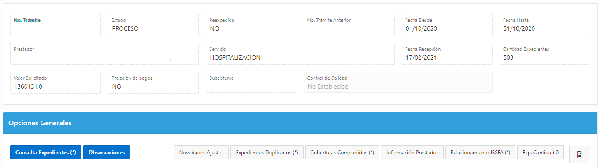

b. Luego de que finaliza el proceso de distribución en la fase de Gestión Documental se realiza la Aplicación de Controles y Creación de Listas de Chequeo; y en Homologación se realiza automáticamente la unificación de ítems 5101001/5501001.

1. ### Secuencial (Uno – Varios Usuarios)
Usualmente esta distribución se utiliza en el caso de trámites con gran cantidad de expedientes, por lo cual se requiere distribuir a varios usuarios.

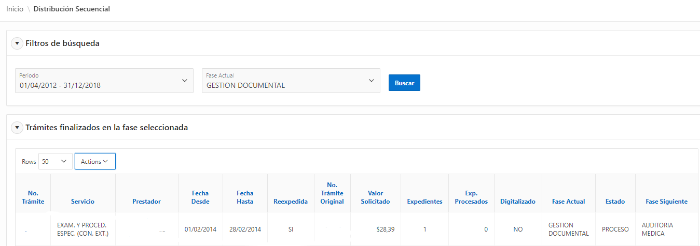

En esta pantalla se muestra un listado con los trámites que están listos para distribuir de un periodo y fase determinada.

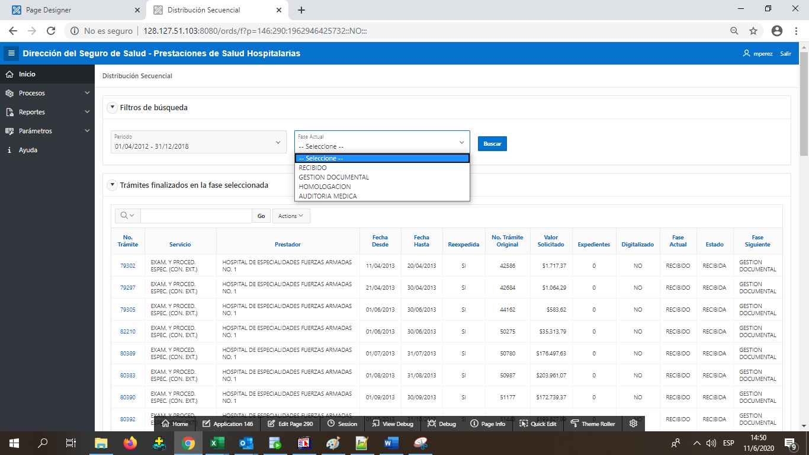

**NOTA:** Para distribuir en una fase determinada se debe seleccionar en Fase Actual, la que al momento se encuentra el trámite.

` `**Fase Actual               Fase a Distribuir**

 

En el listado de trámites se hace clic en el número de trámite a distribuir y a continuación se muestra la siguiente pantalla:

Esta pantalla consta de los siguientes bloques:

*Bloque Trámite:* Se muestran los datos del trámite.

En este bloque se debe revisar lo siguiente:

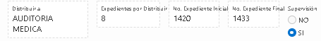

\* *Distribuir a:* Indica la fase a la cual se realizará la distribución, en caso de Gestión Documental se debe revisar este campo pues dependiendo de las condiciones se distribuirá a Auditoría Médica u Homologación.

\* *Expedientes por Distribuir:* Indica el número total de expedientes que existen para distribuir.

\* *No. Expediente Inicial:* Indica el número del primer expediente que se debe incluir dentro del rango de distribución a los distintos usuarios.

\* *No. Expediente Final:* Indica el número del último expediente que se debe incluir dentro del rango de distribución a los distintos usuarios.

\* *Supervisión (SI/NO):* Indica si el trámite requiere supervisión, en cuyo caso el supervisor será quien finalice el trámite (Opción Supervisión/Trámites en Ejecución). 

**NOTA:** Si el trámite es distribuido (varios usuarios) será obligatoria la supervisión y el fin de fase se registrará con el nombre del supervisor o jefe.** 

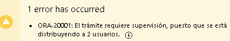

*Bloque Usuarios:* Se muestra el listado de usuarios activos en el periodo y la fase seleccionada.

Para realizar la distribución se debe ingresar el rango de expedientes en los campos Desde y Hasta de los usuarios seleccionados:

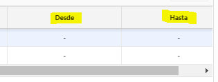

**NOTA:** El primer número del rango ingresado debe ser el mismo del *No. Expediente Inicial* y el último debe ser el mismo del *No. Expediente Final.* El rango ingresado debe ser continuo es decir si indica que inicia del 1 al 100 el rango ingresado debe contener todos los números: 1 – 20, 21 -28, 29 - 62, 63 – 100. Si no se coloca todo el rango se mostrará el siguiente mensaje de error:

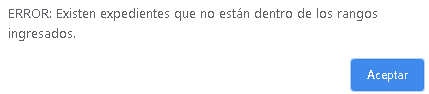

Luego de ingresar el rango de distribución a los distintos usuarios se presiona el botón Distribuir, en el caso de que el trámite no se encuentre Digitalizado se mostrará la siguiente alerta:

Si el proceso se realiza exitosamente se mostrará el siguiente mensaje, el trámite ya no se mostrará en el listado de trámites para distribuir y se mostrará en el listado de Trámites de los usuarios a los cuales se realizó la distribución para su proceso. 

1. ### Múltiple (Un solo usuario)
Usualmente esta distribución se utiliza en el caso de trámites que tienen pocos expedientes y se requiere distribuir a un solo usuario.

*Bloque Filtros de Búsqueda:* Se debe seleccionar el periodo, Fase Actual, Fase a la que se va a distribuir, Supervisión (SI/NO), Tipo Servicio y Prestador.

En caso de que NO requiera supervisión el usuario será el que finalice el trámite.

Luego de seleccionar toda la información se debe presionar el botón Buscar y se mostrarán todos los trámites finalizados, que se pueden distribuir en la fase seleccionada.

Luego de seleccionar los trámites que requiere distribuir se selecciona el usuario y se presiona el botón Distribución.

En caso de que el trámite ya ha sido procesado en la fase que se requiere distribuir se mostrará el siguiente mensaje y no se permitirá realizar la distribución:

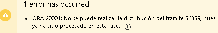

Si el proceso se realiza correctamente se muestra el siguiente mensaje:

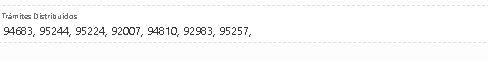

Todos los trámites distribuidos se mostrarán en el listado de trámites del usuario para su proceso.

1. ### Reasignación (Varios Trámites – Un solo usuario)
Esta funcionalidad es utilizada cuando se requiere reasignar expedientes en estado iniciado, pausado o sin procesar a un usuario distinto al que inicialmente fue distribuido o reasignado. 

En la pantalla que se muestra se selecciona el periodo y la fase. 

En caso de requerirlo se puede realizar la búsqueda en un periodo de fechas determinado seleccionando la opción: Usuarios por fecha de asignación.

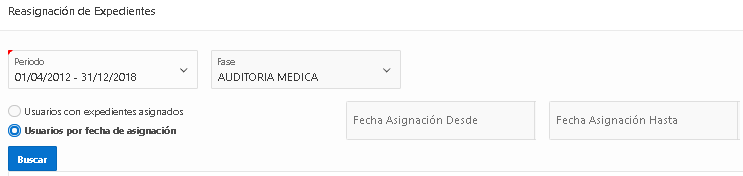

Luego de presionar Buscar se despliega el listado de usuarios que tienen expedientes en estado iniciado, pausado o pendientes de procesar.

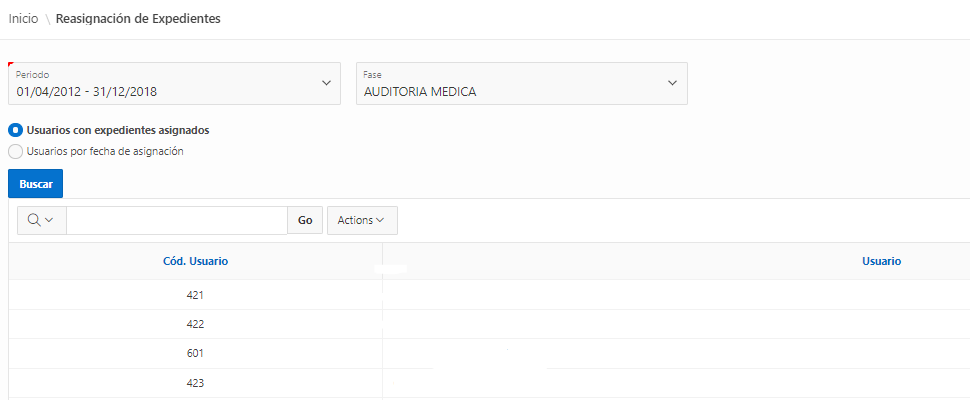

Para iniciar el proceso de Reasignación se debe hacer clic en un usuario y a continuación se mostrará una pantalla con los siguientes bloques:

*Bloque Usuario Asignado:*

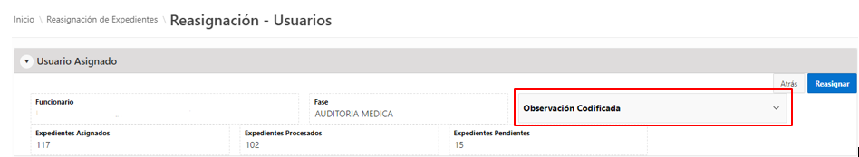

En este bloque se muestra información del usuario seleccionado en la lista con mayor detalle:

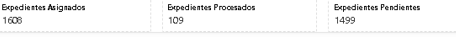

En este caso se indica que el usuario tiene 1499 Expedientes Pendientes (estado iniciado, pausado o por procesar), los mismos que pueden ser reasignados.

Adicionalmente en este bloque se tiene la Observación Codificada, en la cual se seleccionará la razón de la reasignación:

En caso de requerir la creación de una nueva Observación Codifica se lo debe solicitar al Jefe de Auditoria Médica o Liquidación.

*Bloque Trámites con Expedientes Pendientes:*

Se muestra el detalle de los trámites que tienen expedientes pendientes, es decir que se encuentran en estado Iniciado, Pausado o Por Procesar. 

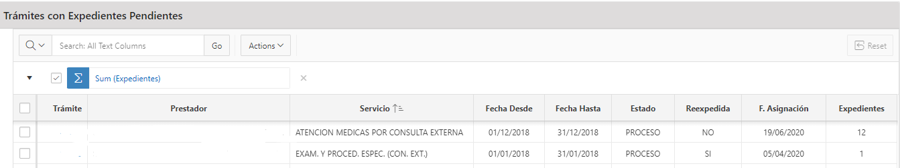

Se debe seleccionar el o los trámites de los cuales se requiere realizar la reasignación de expedientes, cada uno de los cuales tiene información adicional como el número de expedientes pendientes.

Para visualizar la información detallada del trámite con expedientes iniciados, pausados… se debe hacer clic en el número de trámite.

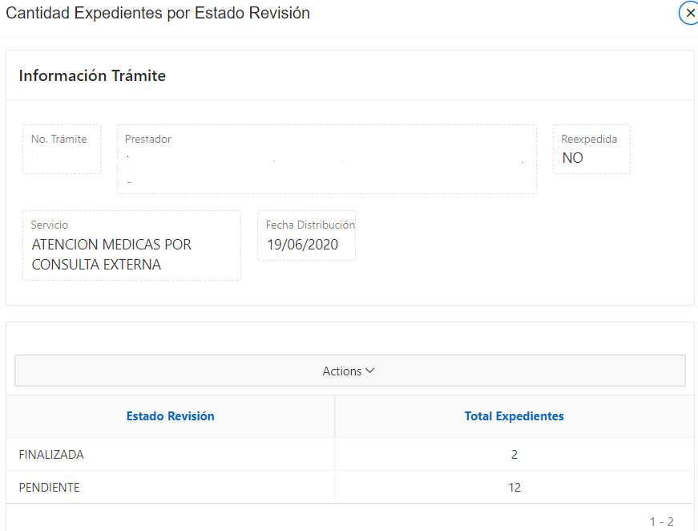

*Bloque Usuarios a asignar:*

En este bloque se debe seleccionar un único usuario al cual se va a realizar la reasignación. Finalmente se debe presionar el botón Reasignar del bloque Usuario Asignado, si el proceso se ha realizado exitosamente se muestra el siguiente mensaje:

En caso de que no se haya seleccionado la Observación Codificada se mostrará el siguiente mensaje:

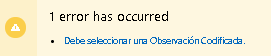

**NOTA:**  Si el usuario seleccionado no se encuentra activo en el periodo y fase seleccionado, no se mostrará el listado de trámites. En este caso se debe ingresar a la parametrización “Usuarios” y Activar al usuario en el periodo y fase requerido.

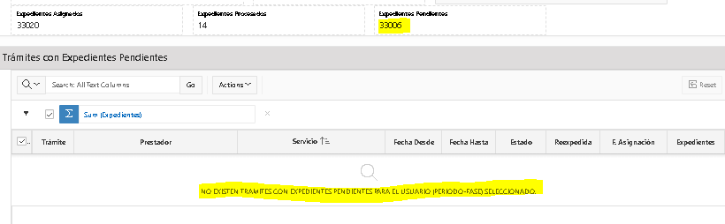

3. ## **Reportes**
Al dar clic en la viñeta de Reportes y Distribución se presentan las siguientes opciones: 

###
### 2.3.1. Reporte de Distribución
En este reporte se muestra el listado de los trámites distribuidos en un lapso de fechas (Fecha Desde – Fecha Hasta), en una Fase y Periodo determinado. 

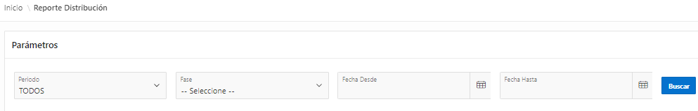

Al presionar el Botón Buscar se muestra el listado de los trámites que fueron distribuidos  con la información del trámite, información de supervisión (Si requiere Supervisión y Supervisor) y la información de Distribución (Fecha, Número de Expedientes, Usuarios a los que se distribuyó).

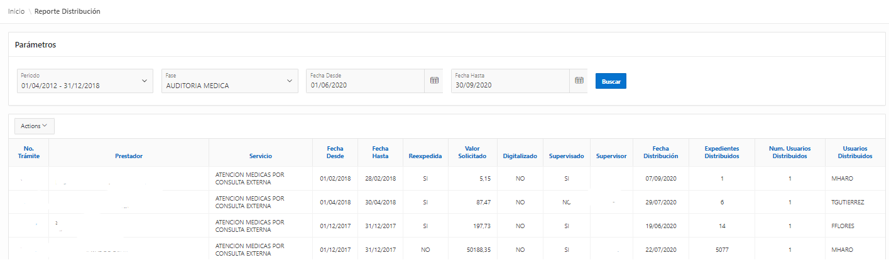

Para descargar el reporte dar clic en Actions, Download.

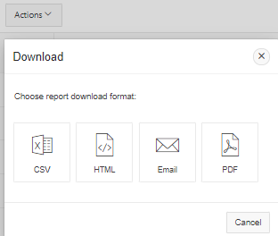

Para visualizar el detalle de distribución en un determinado trámite se debe hacer clic en el número de trámite y a continuación se mostrará una pantalla con la información del Trámite y con un listado de los usuarios asignados a ese trámite con el total de expedientes asignados y la fecha de distribución.

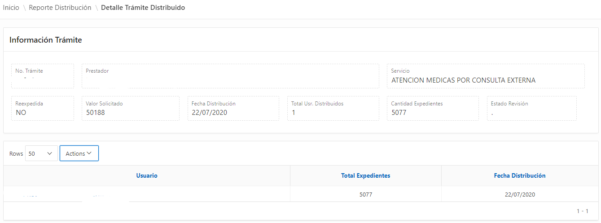
### 2.3.2. Total Exp. Usr.
En este reporte se tiene la opción de visualizar el listado de los usuarios a los que se les ha distribuido un trámite en un lapso de fechas (Fecha Desde – Fecha Hasta), en una Fase y Periodo determinado. 

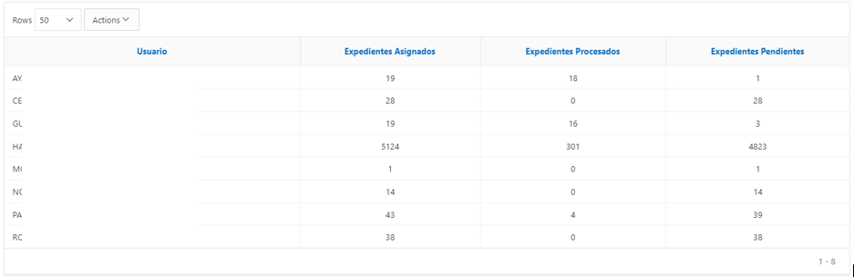

**		Página  PAGE 24 de  NUMPAGES 24**                       

`		`**Versión: 2.0**

